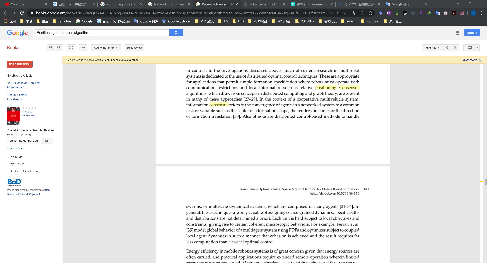
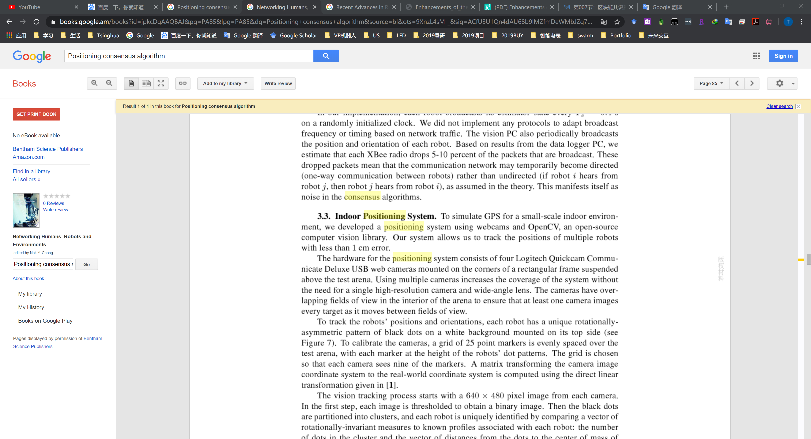
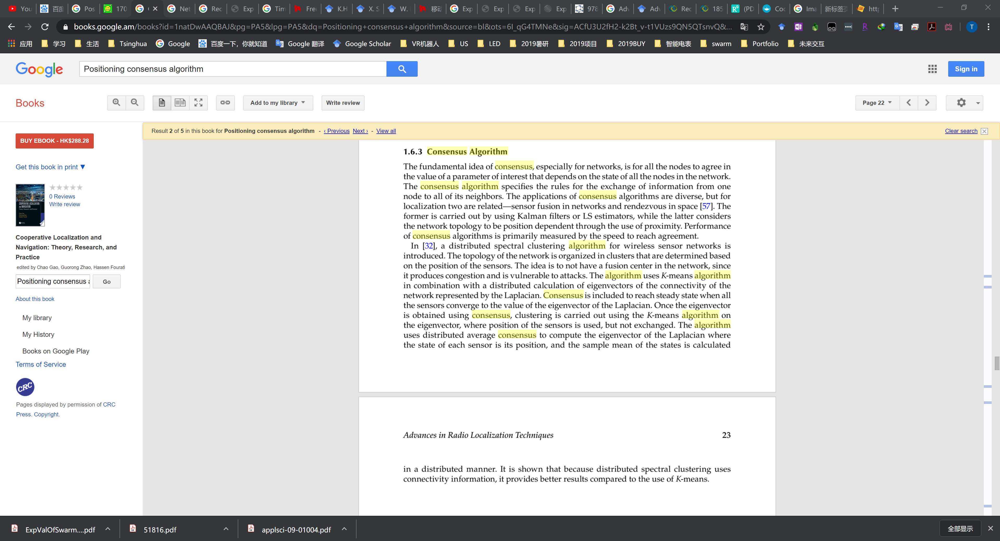

# Positioning consensus algorithm

[Recent Advances in Robotic Systems - Page 142](https://books.google.am/books?id=kXeQDwAAQBAJ&pg=PA142&lpg=PA142&dq=Positioning+consensus+algorithm&source=bl&ots=ZymngJeOHA&sig=ACfU3U1Oufrirbesm2HvjJGk2Z7hUJR3SQ&hl=en&sa=X&ved=2ahUKEwilzo7litjmAhXuyosBHZFACBkQ6AEwB3oECAkQAQ)

DOI: 10.5772/64615

[Time-Energy Optimal Cluster Space Motion Planning for Mobile Robot Formations](https://www.intechopen.com/books/recent-advances-in-robotic-systems/time-energy-optimal-cluster-space-motion-planning-for-mobile-robot-formations)

引文27-35很有用：

[27]	K.H.Movric, F. Lewis, “Cooperative Optimal Control for Multi-Agent Systems on Directed Graph Topologies,” IEEE Transactions on Automatic Control, vol. 59, issue: 3, pp. 769–774, 2014.
[28]	J. Wang, M. Xin, “Integrated Optimal Formation Control of Multiple Unmanned Vehicles,” IEEE Transactions on Control Systems Technology, vol. 21, issue: 5, pp. 1731–1744, 2013.
[29]	X. Sun, C.G. Cassandras, “Optimal Dynamic Formation Control of Multi-Agent Systems in Environments with Obstacles,”, IEEE Conference on Decision and Control 15, 2015.
[30]	W. Ren, R.W. Beard, E.M. Atkins, “Information consensus in multivehicle cooperative control,” IEEE Control Systems, vol. 27, issue: 2, pp. 71–82, 2007.
[31]	K. Elamvazhuthi, S. Berman, “Optimal Control of Stochastic Coverage Strategies for Robotic Swarms,” IEEE Conference on Robotics and Automation 26, 2015.
[32]	C. C. Cheah, S. P. Hou, J. J. E. Slotine, “Region-based Shaped Control for a Swarm of Robots,” Automatica, vol. 45, no. 10, pp. 2406–2411, 2009.
[33]	S. D. Bopardikar, F. Bullo, J. P. Hespanha, “A Cooperative Homicidal Chauffeur Game,” Automatica, vol. 45, pp. 1771–1777, July 2009.
[34]	H. Duan, Q. Luo, Y. Shi, “Hybrid Particle Swarm Optimization and Genetic algorithm for multi-UAV Formation Reconfiguration,” IEEE Computational Intelligence Magazine, vol. 8, issue: 3, 2013.
[35]	S. Ferrari, G. Foderaro, P. Zhu, T. A. Wettergren, “Distributed Optimal Control of Multiscale Dynamical Systems: A Tutorial,” IEEE Control Systems, vol. 36, issue: 2, 2016.

[Experimental Validation of Multi-Agent Coordination by Decentralized Estimation and Control](http://hades.mech.northwestern.edu/images/a/a5/ExpValOfSwarmFormation.pdf)

[Cooperative Localization and Navigation Theory, Research, and Practice](https://books.google.am/books?id=1natDwAAQBAJ&pg=PA5&lpg=PA5&dq=Positioning+consensus+algorithm&source=bl&ots=6I_qG4TMNe&sig=ACfU3U2fH2-k2Bt_v-t1VUzs9QN5QTsnvQ&hl=en&sa=X&ved=2ahUKEwilzo7litjmAhXuyosBHZFACBkQ6AEwCXoECAgQAQ)

Ch1 : Advances in Radio Localization Techniques

1.6.3 consensus algorithm

有一小段综述

其中引文57 32

[Consensus and Cooperation in Networked Multi-Agent Systems](https://ieeexplore.ieee.org/document/4118472)

[Location Based Distributed Spectral Clustering for Wireless Sensor Networks](https://ieeexplore.ieee.org/abstract/document/8233241)

